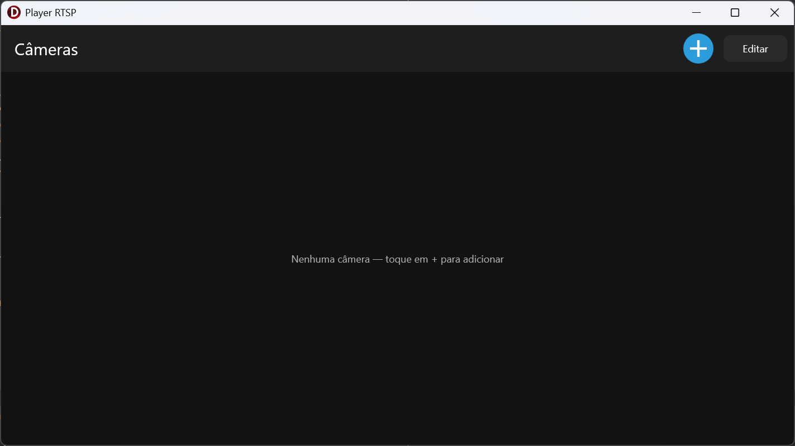
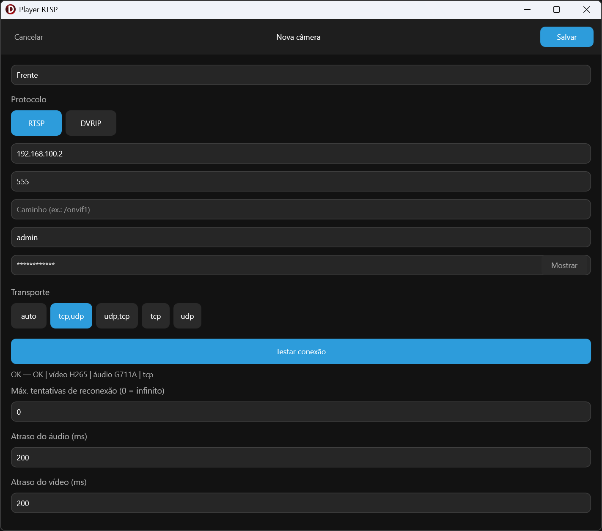
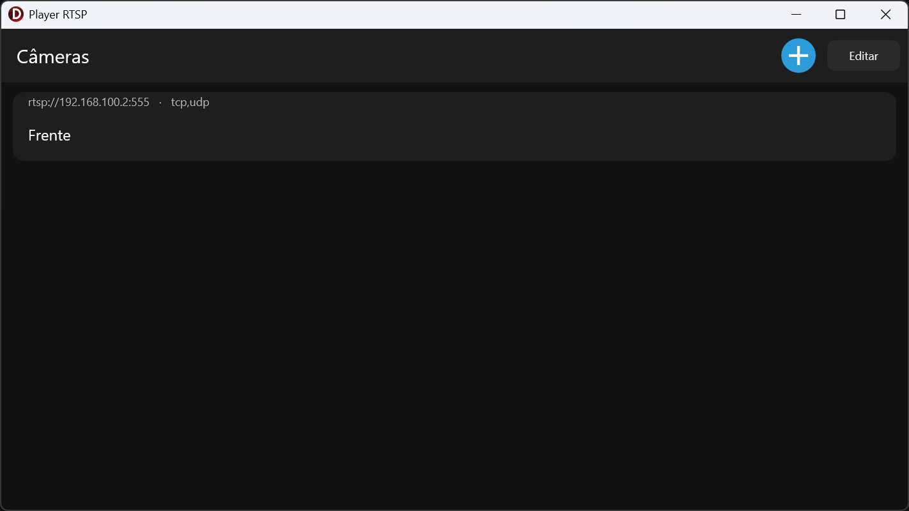
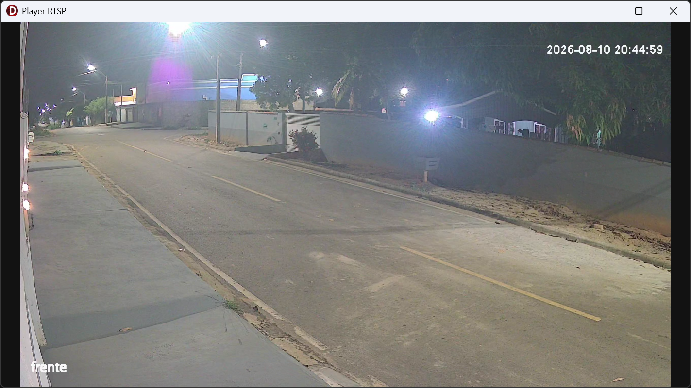

# RTSPlayer

Player de câmeras IP para **Android** e **Windows**, escrito em Delphi/FireMonkey.

O protocolo é implementado direto no socket — RTSP e DVRIP falados na mão, sem
libVLC, sem wrapper, sem componente de terceiro. Só a decodificação de vídeo e
áudio é delegada à plataforma: MediaCodec no Android, FFmpeg no Windows.

[](https://www.embarcadero.com/products/delphi)
[](https://docwiki.embarcadero.com/RADStudio/en/FireMonkey)
[](LICENSE)

## Telas

| Início | Configurar |
|:--:|:--:|
|  |  |
| **Listagem** | **Vídeo ao vivo** |
|  |  |

## Recursos

- **RTSP** com autenticação Basic e Digest, `DESCRIBE`/`SETUP`/`PLAY`, keep-alive
  por `GET_PARAMETER` ou `OPTIONS`
- **Transporte TCP (interleaved) ou UDP**, com ordem de preferência configurável
  e fallback automático por timeout (`auto`, `tcp,udp`, `udp,tcp`, `tcp`, `udp`)
- **DVRIP / Sofia** (DVRs e câmeras Xiongmai/XM, porta 34567) — login, `OPMonitor`
  e demux do fluxo de mídia
- **Reconexão automática** com backoff exponencial, supervisionada por câmera,
  com limite opcional de tentativas
- **Fallback de decoder no Android**: quando o decoder de hardware falha (comum em
  1080p+ com drivers problemáticos), a sessão migra para o decoder de software
- **Teste de conexão** na tela de cadastro: faz só o handshake e informa o
  resultado, sem abrir o stream
- **Gravação `.vms`** (formato próprio: blocos indexados com CRC32) — a engine
  suporta, o app roda com a gravação desligada
- **Log em tela**, útil para diagnosticar câmera que não abre

## Codecs

| Vídeo | Áudio |
|---|---|
| H.264 | AAC |
| H.265 / HEVC | PCM |
| MJPEG | G.711 (µ-law e A-law) |
| | G.726 (16/24/32/40 kbps) |

## Plataformas

| Plataforma | Decodificação | Observação |
|---|---|---|
| Android / Android64 | MediaCodec via JNI | fallback automático para decoder de software |
| Win64 | FFmpeg | DLLs incluídas em `bin/Win64/Release` |

## Estrutura

```
src/
├── Net/          sockets TCP e UDP atrás de uma interface
├── Rtsp/         cliente RTSP: mensagens, URL, autenticação, transporte
├── Sdp/          parser de SDP
├── Rtp/          pacote RTP e demux por canal interleaved ou payload type
├── Depacketizer/ RTP → frames (H264, H265, MJPEG, AAC, PCM, G711, G726)
├── Dvrip/        protocolo Sofia/DVRIP: handshake, comandos e mídia
├── Domain/       sessão, supervisor, política de reconexão, tipos e portas
├── Recording/    escrita e leitura do formato .vms
├── Media/        fachada do renderer (escolhe o backend por plataforma)
├── Android/      backend MediaCodec (vídeo, áudio, JNI)
├── Win/          backend FFmpeg
├── App/          composition root, configuração, logger, clock
└── UI/           shell FMX + frames de lista, player e edição
```

A separação é intencional: `Domain` e os protocolos não conhecem FMX nem
plataforma. A UI conversa com a sessão através de `IMediaSink`, e
`VMS.Media.Renderer` decide em tempo de compilação qual backend entra.

## Compilando

Requer **Delphi 12 Athens** (FireMonkey). Não há dependência externa além das
DLLs do FFmpeg, que já estão no repositório.

1. Abra `rtsplayer.dproj` no RAD Studio
2. Escolha a plataforma (`Win64`, `Android` ou `Android64`)
3. Compile e execute

No Windows, os DLLs precisam estar ao lado do executável — é o caso ao rodar a
partir de `bin/Win64/Release`. No Android eles não são usados: a decodificação
vai por MediaCodec.

## Configuração

As câmeras são cadastradas pela própria interface (protocolo, host, porta,
caminho, usuário, senha, transporte e atrasos de sincronismo A/V). A lista é
gravada em `cameras.json`, na pasta Documentos do dispositivo:

```json
[
  {
    "name": "Portaria",
    "url": "rtsp://192.0.2.10:554/onvif1",
    "user": "admin",
    "password": "",
    "transport": "tcp,udp",
    "maxRetries": 0,
    "audioDelayMs": 200,
    "videoDelayMs": 200
  }
]
```

- `transport` aceita `auto`, `tcp`, `udp`, `tcp,udp` ou `udp,tcp` — a ordem é a
  de preferência, e a troca acontece por timeout
- `maxRetries` igual a `0` reconecta indefinidamente
- `audioDelayMs` / `videoDelayMs` ajustam o jitter buffer de cada trilha
- para DVRIP, use `dvrip://host:34567` como URL

> ⚠️ As senhas ficam em texto puro nesse arquivo, como acontece na maioria dos
> clientes RTSP (o protocolo precisa da senha em claro para calcular o Digest).
> Ele vive na área privada do app, mas não é um cofre — trate o dispositivo como
> parte da superfície de ataque das suas câmeras.

## Formato .vms

Container próprio, pensado para gravação contínua com perda mínima em caso de
queda de energia:

- **Header** `VMS1` com metadados das trilhas (codec, resolução, extradata)
- **Blocos** `BLK` com índice de samples + payload e um CRC32 ao final —
  cada bloco é fechado a cada N samples, N ms ou N bytes, o que vier primeiro
- **Footer** `VEOF` com total de blocos, duração e offset do último bloco

Um arquivo truncado continua legível até o último bloco completo: o leitor para
quando faltam bytes, em vez de falhar o arquivo inteiro. Ele também tem um modo
"live", que aguarda o escritor em vez de terminar no fim do arquivo. O CRC é
gravado, mas o leitor ainda não o valida.

## Licença

[AGPL-3.0](LICENSE).
